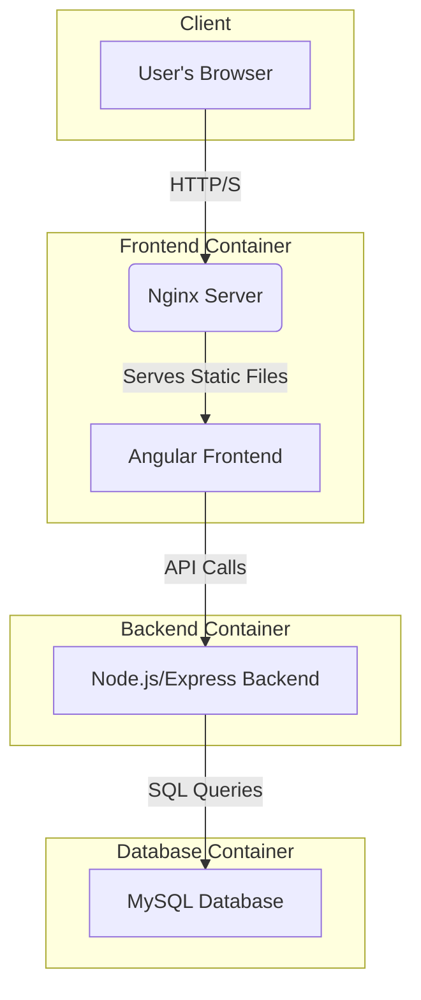

# **Movie Management Application**

**A Full-Stack Showcase**

Saeed Al Salari

---

## **Introduction**

**What is this project?**

A full-stack web application for creating, managing, and rating a personal movie collection.

**The Goal:**

To build a modern, responsive, and feature-rich single-page application (SPA) that demonstrates best practices in both frontend and backend development.


---

## **Technology Stack**

A look at the technologies powering the application.

| Layer          | Technology                                                                                                                                                                                                                 |
| -------------- | -------------------------------------------------------------------------------------------------------------------------------------------------------------------------------------------------------------------------- |
| **Frontend**   |   |
| **Backend**    |    |
| **Database**   |                                                                                                                          |
| **Deployment** |                     |

---

## **Application Architecture**

A simple, robust, and scalable three-tier architecture.



---

## **Core Features**

- **Full CRUD Functionality:** Create, Read, Update, and Delete movies.
- **Dynamic Ratings:** Rate movies from 1-5 stars, with real-time average calculation.
- **Live Search:** Instantly filter the collection with a debounced search input.
- **Inline Editing:** Edit movie details directly in the movie card for a seamless UX.
- **Responsive UI:** A clean interface that works across devices.

---

### **Feature Spotlight: Live Search**

To prevent excessive API calls while the user is typing, we use **RxJS** to debounce the input.

**`movie-list.component.ts`**

```typescript
private searchSubject = new Subject<string>();

ngOnInit(): void {
  this.searchSubscription = this.searchSubject.pipe(
    // Wait for 300ms of inactivity
    debounceTime(300),
    // Ignore if the new value is the same as the last
    distinctUntilChanged()
  ).subscribe(searchTerm => {
    this.searchMovies(searchTerm);
  });
}

onSearchTermChange(): void {
  this.searchSubject.next(this.searchTerm);
}
```

---

### **Feature Spotlight: Inline Editing**

The UI toggles between "display" and "edit" modes within the same component, providing a fluid user experience.

**`movie-list.component.html`**

```html
<!-- Display mode -->
<ng-container *ngIf="editingMovieId !== movie.id">
  <h3 class="text-xl font-bold">{{ movie.title }}</h3>
</ng-container>

<!-- Edit mode -->
<ng-container *ngIf="editingMovieId === movie.id">
  <input type="text" [(ngModel)]="editedMovie.title" />
</ng-container>
```

- A shallow copy (`{...movie}`) is created to prevent modifying the original data until "Save" is clicked.

---

## **Deployment with Docker**

The entire application stack is containerized for portability, consistency, and ease of deployment using a multi-stage build for the frontend.

```dockerfile
# Stage 1: Build the Angular application
FROM node:18-alpine AS build
WORKDIR /app
COPY . .
RUN npm install && npm run build -- --configuration production

# Stage 2: Serve the static files from Nginx
FROM nginx:alpine
# Copy only the compiled output from the build stage
COPY --from=build /app/dist/frontend/browser /usr/share/nginx/html
COPY nginx.conf /etc/nginx/conf.d/default.conf
```

**Benefit:** The final image is tiny and secure, containing only the static files and a lightweight web server.

---

## **Code Quality & Best Practices**

- **Single Responsibility Principle:** `MovieListComponent` handles UI logic, while `MovieService` handles API communication.
- **Asynchronous Handling:** Extensive use of **RxJS Observables** for managing HTTP requests and events.
- **Robust Error Handling:** User-friendly error messages are displayed for API failures.
- **Type Safety:** **TypeScript** is used throughout the frontend for cleaner, more maintainable code.
- **Clean API Design:** A well-defined RESTful API in the backend provides clear endpoints for all frontend operations.

---

## **Live Demo**

Let's see the application in action.

---

## **Future Improvements**

- **User Authentication:** Implement JWT-based login to allow for user-specific movie collections.
- **Pagination:** Add server-side pagination to handle large movie collections efficiently.
- **Reactive Forms:** Refactor forms to use Angular's Reactive Forms for more robust validation.
- **Advanced Filtering:** Allow users to filter by multiple genres or a range of years.
- **CI/CD Pipeline:** Set up a GitHub Actions workflow to automatically build and deploy the Docker containers.

---

## **Thank You**

**Questions?**
